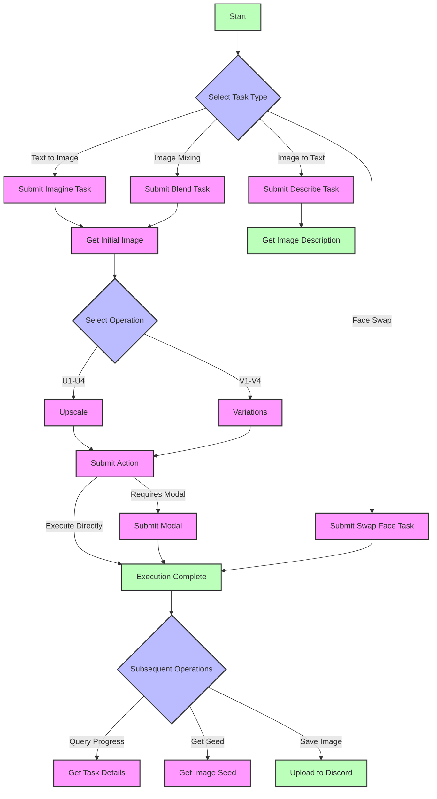

<Callout type="info" title="Please Note">
  This API is **not an official Midjourney API**, but rather a Midjourney proxy API implemented based on author **novicezk**'s open-source project
  [**midjourney-proxy**](https://github.com/novicezk/midjourney-proxy).
</Callout>

    This project is divided into two versions, both adapted by New API:

    - Open-source version [midjourney-proxy](https://github.com/novicezk/midjourney-proxy)

    - Paid version [midjourney-proxy-plus](https://github.com/litter-coder/midjourney-proxy-plus)

    We are very grateful for the author's contributions, which allow us to conveniently use Midjourney's powerful features. If you have time, please give the author a Star. If you are able, we recommend supporting the author's paid version, which offers more features.

| Feature Category                  | Open-source Version | Paid Version |
| --------------------------------- | ------------------- | ------------ |
| **Basic Features**                |                     |              |
| Imagine Command and Related Actions | ✓                   | ✓            |
| Image Prompt Support              | ✓                   | ✓            |
| Blend (Image Mixing)              | ✓                   | ✓            |
| Describe (Image to Text)          | ✓                   | ✓            |
| Real-time Task Progress           | ✓                   | ✓            |
| Chinese Prompt Translation        | ✓                   | ✓            |
| Prompt Sensitive Word Detection   | ✓                   | ✓            |
| User-Token Connects to WSS        | ✓                   | ✓            |
| Multi-Account Configuration       | ✓                   | ✓            |
| **Advanced Features**             |                     |              |
| Shorten (Prompt Analysis)         | ✗                   | ✓            |
| Pan (Focus Movement)              | ✗                   | ✓            |
| Zoom (Image Zoom)                 | ✗                   | ✓            |
| Vary Region (Partial Redraw)      | ✗                   | ✓            |
| Associate Button Actions and Remix Mode | ✗                   | ✓            |
| Get Image Seed Value              | ✗                   | ✓            |
| **Account Management**            |                     |              |
| Account Pool Persistence          | ✗                   | ✓            |
| Multiple Storage Support (Redis/MySQL) | ✗                   | ✓            |
| Account Information Retrieval and Setting | ✗                   | ✓            |
| Task Cancellation Feature         | ✗                   | ✓            |
| Built-in Admin Panel              | ✗                   | ✓            |
| **Smart Features**                |                     |              |
| MJ V6.0 Support                   | ✗                   | ✓            |
| Automatic Account Status Monitoring | ✗                   | ✓            |
| Automatic Mode Switching          | ✗                   | ✓            |
| Niji・Journey Bot Support          | ✗                   | ✓            |
| InsightFace Face Service          | ✗                   | ✓            |
| **Security Performance**          |                     |              |
| Dynamic Configuration Support     | ✗                   | ✓            |
| Token Disconnection Issue Fix     | ✗                   | ✓            |
| Automatic Verification Feature    | ✗                   | ✓            |
| Automatic Appeal for Prohibited Words | ✗                   | ✓            |

## 📝 Introduction

Midjourney is a powerful image generation and processing model that can create, edit, and modify images based on natural language descriptions. By providing different interfaces, various image generation and processing tasks can be accomplished.

## 🔄 Flowchart



### Flow Description

1.  **Initial Tasks**
    -   Imagine: Text to image generation
    -   Blend: Multi-image mixing
    -   Describe: Image description
    -   Swap Face: Face replacement

2.  **Image Processing**
    -   U1-U4: Upscale operation
    -   V1-V4: Variation generation
    -   Pan: Image panning
    -   Zoom: Image zooming

3.  **Special Flows**
    -   Action + Modal: Operations requiring modal confirmation
    -   Action Direct Execution: Operations not requiring a modal

4.  **Task Management**
    -   Get task details
    -   Get image Seed
    -   Upload to Discord

## 💡 Request Examples

### Submit Imagine Task ✅

```bash
curl --location --request POST 'https://你的newapi服务器地址/mj/submit/imagine' \
--header 'Authorization: Bearer $NEWAPI_API_KEY' \
--header 'Accept: application/json' \
--header 'Content-Type: application/json' \
--data-raw '{
  "botType": "MID_JOURNEY",
  "prompt": "Cat",
  "base64Array": [],
  "accountFilter": {
    "channelId": "",
    "instanceId": "",
    "modes": [],
    "remark": "",
    "remix": true,
    "remixAutoConsidered": true
  },
  "notifyHook": "",
  "state": ""
}'
```

**Response Example:**

```json
{
  "code": 1,
  "description": "提交成功",
  "properties": {},
  "result": 1320098173412546
}
```

### Submit Blend Task ✅

```bash
curl --location --request POST 'https://你的newapi服务器地址/mj/submit/blend' \
--header 'Authorization: Bearer $NEWAPI_API_KEY' \
--header 'Accept: application/json' \
--header 'Content-Type: application/json' \
--data-raw '{
  "botType": "MID_JOURNEY",
  "base64Array": [
    "data:image/png;base64,xxx1",
    "data:image/png;base64,xxx2"
  ],
  "dimensions": "SQUARE",
  "accountFilter": {
    "channelId": "",
    "instanceId": "",
    "modes": [],
    "remark": "",
    "remix": true,
    "remixAutoConsidered": true
  },
  "notifyHook": "",
  "state": ""
}'
```

**Response Example:**

```json
{
  "code": 1,
  "description": "提交成功",
  "properties": {},
  "result": 1320098173412546
}
```

### Submit Describe Task ✅

```bash
curl --location --request POST 'https://你的newapi服务器地址/mj/submit/describe' \
--header 'Authorization: Bearer $NEWAPI_API_KEY' \
--header 'Accept: application/json' \
--header 'Content-Type: application/json' \
--data-raw '{
  "botType": "MID_JOURNEY",
  "base64": "data:image/png;base64,xxx",
  "accountFilter": {
    "channelId": "",
    "instanceId": "",
    "modes": [],
    "remark": "",
    "remix": true,
    "remixAutoConsidered": true
  },
  "notifyHook": "",
  "state": ""
}'
```

**Response Example:**

```json
{
  "code": 1,
  "description": "提交成功",
  "properties": {},
  "result": 1320098173412546
}
```

### Submit Modal ✅

```bash
curl --location --request POST 'https://你的newapi服务器地址/mj/submit/modal' \
--header 'Authorization: Bearer $NEWAPI_API_KEY' \
--header 'Accept: application/json' \
--header 'Content-Type: application/json' \
--data-raw '{
  "maskBase64": "",
  "prompt": "",
  "taskId": "14001934816969359"
}'
```

**Response Example:**

```json
{
  "code": 1,
  "description": "提交成功",
  "properties": {},
  "result": 1320098173412546
}
```

### Submit Swap Face Task ✅

```bash
curl --location --request POST 'https://你的newapi服务器地址/mj/insight-face/swap' \
--header 'Authorization: Bearer $NEWAPI_API_KEY' \
--header 'Accept: application/json' \
--header 'Content-Type: application/json' \
--data-raw '{
  "sourceBase64": "data:image/jpeg;base64,/9j/4AAQSkZJRgABAQAAAQABAAD/2wCEAAkGBwgHBgkIBwgKCgkLDRYPDQwMDRsUFRAWIB0iIiAdHx8kKDQsJCYxJx8fLT0tMTU3Ojo6Iys/RDnYdriP1wsS81kwU8OVs/R3xu8s6bX7+zYnOH8coSqpmRSBjqerjcBlr2OB/lbAf/2Q==",
  "targetBase64": "data:image/jpeg;base64,/9j/4AAQSkZJRgABAQAAAQABAAD/2wCEAAkGBwgHBgkIBwgKCgkLDRYPDQwMDRsUFRAWIB0iIiAdHx8kKDQsJCYxJx8fLT0tMTU3Ojo6Iys/RD849k="
}'
```

**Response Example:**

```json
{
  "code": 0,
  "description": "string",
  "result": "string"
}
```

### Execute Action ✅

```bash
curl --location --request POST 'https://你的newapi服务器地址/mj/submit/action' \
--header 'Authorization: Bearer $NEWAPI_API_KEY' \
--header 'Accept: application/json' \
--header 'Content-Type: application/json' \
--data-raw '{
  "chooseSameChannel": true,
  "customId": "MJ::JOB::upsample::1::82c51c9d-bc33-4c07-a471-36c3dcb1a6f0",
  "taskId": "1728781324658687",
  "accountFilter": {
    "channelId": "",
    "instanceId": "",
    "modes": [],
    "remark": "",
    "remix": true,
    "remixAutoConsidered": true
  },
  "notifyHook": "",
  "state": ""
}'
```

**Response Example:**

```json
{
  "code": 1,
  "description": "提交成功",
  "properties": {},
  "result": 1320098173412546
}
```

### Upload Files to Discord ✅

```bash
curl --location --request POST 'https://你的newapi服务器地址/mj/submit/upload-discord-images' \
--header 'Authorization: Bearer $NEWAPI_API_KEY' \
--header 'Accept: application/json' \
--header 'Content-Type: application/json' \
--data-raw '{
  "base64Array": [],
  "filter": {
    "channelId": "",
    "instanceId": "",
    "remark": ""
  }
}'
```

**Response Example:**

```json
{
  "code": 0,
  "description": "string",
  "result": ["string"]
}
```

### Query Tasks by ID List ✅

```bash
curl --location --request POST 'https://你的newapi服务器地址/mj/task/list-by-condition' \
--header 'Accept: application/json' \
--header 'Authorization: Bearer $NEWAPI_API_KEY' \
--header 'Content-Type: application/json' \
--data-raw '{
  "ids": []
}'
```

**Response Example:**

```json
[
  {
    "action": "IMAGINE",
    "buttons": [
      {
        "customId": "string",
        "emoji": "string",
        "label": "string",
        "style": 0,
        "type": 0
      }
    ],
    "description": "string",
    "failReason": "string",
    "finishTime": 0,
    "id": "string",
    "imageUrl": "string",
    "progress": "string",
    "prompt": "string",
    "promptEn": "string",
    "properties": {},
    "startTime": 0,
    "state": "string",
    "status": "NOT_START",
    "submitTime": 0
  }
]
```

### Get Task by ID ✅

```bash
curl --location --request GET 'https://你的newapi服务器地址/mj/task/{id}/fetch' \
--header 'Accept: application/json' \
--header 'Authorization: Bearer $NEWAPI_API_KEY' \
--header 'Content-Type: application/json'
```

**Response Example:**

```json
{
  "action": "IMAGINE",
  "buttons": [
    {
      "customId": "string",
      "emoji": "string",
      "label": "string",
      "style": 0,
      "type": 0
    }
  ],
  "description": "string",
  "failReason": "string",
  "finishTime": 0,
  "id": "string",
  "imageUrl": "string",
  "progress": "string",
  "prompt": "string",
  "promptEn": "string",
  "properties": {},
  "startTime": 0,
  "state": "string",
  "status": "NOT_START",
  "submitTime": 0
}
```

### Get Task Image Seed ✅

```bash
curl --location --request GET 'https://你的newapi服务器地址/mj/task/{id}/image-seed' \
--header 'Accept: application/json' \
--header 'Authorization: Bearer $NEWAPI_API_KEY' \
--header 'Content-Type: application/json'
```

**Response Example:**

```json
{
  "code": 0,
  "description": "string",
  "result": "string"
}
```

## 📮 Requests

### Endpoints

#### Submit Imagine Task

```
POST /mj/submit/imagine
```

Create images based on text prompts.

#### Submit Blend Task

```
POST /mj/submit/blend
```

Generate new images by blending multiple input images.

#### Submit Describe Task

```
POST /mj/submit/describe
```

Generate text descriptions based on input images.

#### Submit Modal

```
POST /mj/submit/modal
```

Submit modal information to adjust image generation details.

#### Submit Swap Face Task

```
POST /mj/insight-face/swap
```

Perform face swapping based on source and target images.

#### Execute Action

```
POST /mj/submit/action
```

Perform subsequent operations on generated images, such as upscaling, adjusting, etc.

#### Upload Files to Discord

```
POST /mj/submit/upload-discord-images
```

Upload images to the Discord platform.

#### Query Tasks by ID List

```
POST /mj/task/list-by-condition
```

Query task details based on a specified list of task IDs.

#### Get Task by ID

```
GET /mj/task/{id}/fetch
```

Get task details by task ID.

#### Get Task Image Seed

```
GET /mj/task/{id}/image-seed
```

Get the seed value of the image generated by the specified task.

### Authentication Method

Include the following in the request header for API key authentication:

```
Authorization: Bearer $NEWAPI_API_KEY$OPENAI_API_KEY
```

Where `$OPENAI_API_KEY` is your API key.

### Request Body Parameters

#### Submit Imagine Task

##### `botType`

-   Type: Enum string
-   Required: No
-   Default: MID_JOURNEY
-   Options:
    -   `MID_JOURNEY`: Midjourney model
    -   `NIJI_JOURNEY`: Niji Journey model
-   Description: Select the bot type to use

##### `prompt`

-   Type: String
-   Required: Yes
-   Description: Text prompt for image generation
-   Tip:
    -   Use clear and specific descriptions
    -   Can include details like art style, composition, etc.
    -   Supports English and Chinese input

##### `base64Array`

-   Type: String array
-   Required: No
-   Description: Base64 encoded array of image prompts
-   Format: Each element should be a complete base64 image string, including the MIME type prefix

##### `accountFilter`

-   Type: Object
-   Required: No
-   Properties:
    -   `channelId`: Channel ID
    -   `instanceId`: Account instance ID
    -   `modes`: Array of account modes, options: RELAX, FAST, TURBO
    -   `remark`: Content included in the remark
    -   `remix`: Whether the account supports remix
    -   `remixAutoConsidered`: Remix auto-submission setting

##### `notifyHook`

-   Type: String
-   Required: No
-   Description: Callback address after task completion; uses global notifyHook if empty

##### `state`

-   Type: String
-   Required: No
-   Description: Custom state parameter, can be used to track requests

#### Submit Blend Task

##### `base64Array`

-   Type: String array
-   Required: Yes
-   Description: Base64 encoded array of images to blend
-   Format: Must contain base64 strings for 2-5 images

##### `dimensions`

-   Type: Enum string
-   Required: No
-   Options:
    -   `PORTRAIT`: 2:3 ratio
    -   `SQUARE`: 1:1 ratio
    -   `LANDSCAPE`: 3:2 ratio
-   Description: Aspect ratio setting for the output image

#### Submit Describe Task

##### `base64`

-   Type: String
-   Required: Yes
-   Description: Base64 encoding of the image to be described
-   Format: Complete base64 string, including MIME type prefix

#### Submit Modal Task

##### `maskBase64`

-   Type: String
-   Required: No
-   Description: Base64 encoded mask image for partial redraw

##### `prompt`

-   Type: String
-   Required: No
-   Description: Text prompt for the redraw area

##### `taskId`

-   Type: String
-   Required: Yes
-   Description: ID of the original task

#### Submit Swap Face Task

##### `sourceBase64`

-   Type: String
-   Required: Yes
-   Description: Base64 encoding of the source image for the face
-   Requirement: The image must contain a clear face

##### `targetBase64`

-   Type: String
-   Required: Yes
-   Description: Base64 encoding of the target image
-   Requirement: The image must contain the face to be replaced

#### Execute Action

##### `chooseSameChannel`

-   Type: Boolean
-   Required: No
-   Default: false
-   Description: Whether to select an account under the same channel

##### `customId`

-   Type: String
-   Required: Yes
-   Description: Action identifier
-   Format: A string in a specific format, e.g., "MJ::JOB::upsample::1::xxx"

##### `taskId`

-   Type: String
-   Required: Yes
-   Description: ID of the task to perform the action on

#### Upload Files to Discord

##### `base64Array`

-   Type: String array
-   Required: Yes
-   Description: Base64 encoded array of images to upload

##### `filter`

-   Type: Object
-   Required: No
-   Properties:
    -   `channelId`: Target Channel ID
    -   `instanceId`: Account instance ID
    -   `remark`: Remark information

#### Query Tasks by ID List

##### `ids`

-   Type: String array
-   Required: Yes
-   Description: List of task IDs to query

### Common Response Format

All interfaces return a similar response structure:

##### `code`

-   Type: Integer
-   Description: Status code

| Status Code | Description       |
| ----------- | ----------------- |
| 1           | Submission successful |
| 22          | Task queued       |
| 21          | Parameter error   |
| 23          | System error      |
| 24          | Account unavailable |
| 25          | Insufficient quota  |

##### `description`

-   Type: String
-   Description: Response description message

##### `properties`

-   Type: Object
-   Description: Extended properties

##### `result`

-   Type: String or array
-   Description: Return result, could be task ID or other data

## 📥 Responses

### Successful Response

#### `action`

-   Type: Enum string
-   Description: Task type

| String Value | Description       |
| ------------ | ----------------- |
| `IMAGINE`    | Create image      |
| `UPSCALE`    | Upscale image     |
| `VARIATION`  | Generate variation |
| `ZOOM`       | Zoom image        |
| `PAN`        | Pan image         |
| `DESCRIBE`   | Describe image    |
| `BLEND`      | Blend images      |
| `SHORTEN`    | Shorten prompt    |
| `SWAP_FACE`  | Face swap         |

#### `buttons`

-   Type: Object array
-   Description: Executable action buttons

| Array Property | Description                     |
| -------------- | ------------------------------- |
| `customId`     | Action identifier               |
| `emoji`        | Button icon                     |
| `label`        | Button text                     |
| `style`        | Style (2=Primary, 3=Green)      |
| `type`         | Type used internally by the system |

#### `description`

-   Type: String
-   Description: Task description message

#### `failReason`

-   Type: String
-   Description: Reason for task failure

#### `finishTime`

-   Type: Integer
-   Description: Task completion timestamp

#### `id`

-   Type: String
-   Description: Unique task identifier

#### `imageUrl`

-   Type: String
-   Description: URL of the generated image

#### `progress`

-   Type: String
-   Description: Task progress information

#### `prompt`

-   Type: String
-   Description: Original prompt

#### `promptEn`

-   Type: String
-   Description: English prompt

#### `status`

-   Type: Enum string
-   Description: Task status

| String Value  | Description       |
| ------------- | ----------------- |
| `NOT_START`   | Not started       |
| `SUBMITTED`   | Submitted         |
| `MODAL`       | In modal operation |
| `IN_PROGRESS` | In progress       |
| `FAILURE`     | Failed            |
| `SUCCESS`     | Successful        |
| `CANCEL`      | Canceled          |

#### `submitTime`

-   Type: Integer
-   Description: Task submission timestamp

#### `startTime`

-   Type: Integer
-   Description: Task start execution timestamp

### Error Responses

When there is an issue with the request, the API will return an error response:

#### HTTP Status Codes

-   `400 Bad Request`: Invalid request parameters
-   `401 Unauthorized`: API key invalid or not provided
-   `403 Forbidden`: Insufficient permissions
-   `404 Not Found`: Resource not found
-   `429 Too Many Requests`: Request frequency exceeded
-   `500 Internal Server Error`: Internal server error

#### Error Response Format

```json
{
  "code": `<错误码>`,
  "description": "错误描述信息",
  "result": null
}
```

## 💡 Best Practices

### Prompt Writing Suggestions

1.  Use clear and concise language to describe the desired image content
2.  Refer to the various parameters supported by Midjourney to control image style
3.  Appropriately use negative descriptions to exclude unwanted elements
4.  Use image URLs as references to guide generation

### Image Generation Workflow

1.  Submit an Imagine task to get an initial image
2.  Optimize further with Blend, Modal, and other tasks as needed
3.  Execute Action to fine-tune the image
4.  Upload and save satisfactory result images

### Image Format Requirements

1.  Supported image formats:
    -   JPEG/JPG
    -   PNG
    -   GIF (static)
    -   WEBP

2.  Image size limits:
    -   File size: Maximum 4MB
    -   Resolution: Recommended 1024x1024 or higher
    -   Aspect ratio: Supports 1:1, 2:3, 3:2

### Performance Optimization Suggestions

1.  Base64 Encoding:
    -   Use standard Base64 encoding format
    -   Include the correct MIME type prefix
    -   Compress images to reduce data transfer

2.  Task Processing:
    -   Use webhooks to receive task completion notifications
    -   Set reasonable retry strategies
    -   Recommended to use asynchronous processing

### Error Handling

-   Implement request retry mechanism
-   Add error logging
-   Set reasonable timeout durations