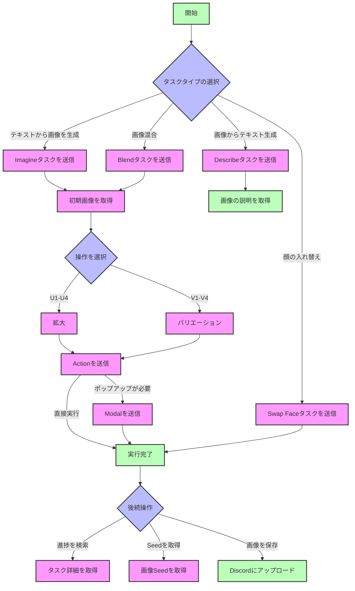

<Callout type="info" title="ご注意ください">
  このAPIは**Midjourney公式のAPIではありません**。著者**novicezk**のオープンソースプロジェクト
  [**midjourney-proxy**](https://github.com/novicezk/midjourney-proxy)
  に基づいて実装されたMidjourneyプロキシAPIです。
</Callout>

    このプロジェクトには2つのバージョンがあり、New APIはどちらにも対応しています。

    - オープンソース版 [midjourney-proxy](https://github.com/novicezk/midjourney-proxy)

    - 有料版 [midjourney-proxy-plus](https://github.com/litter-coder/midjourney-proxy-plus)

    Midjourneyの強力な機能を便利に利用できるようにしてくださった作者の貢献に深く感謝いたします。もしお時間があれば、作者にStarを付けてください。もし可能であれば、より多くの機能をサポートする作者の有料版を支援することをお勧めします。

| 機能カテゴリ                  | オープンソース版 | 有料版 |
| ------------------------- | ------ | ------ |
| **基本機能**              |        |        |
| Imagineコマンドおよび関連アクション     | ✓      | ✓      |
| 参照画像（Image Prompt）のサポート                  | ✓      | ✓      |
| Blend（画像混合）           | ✓      | ✓      |
| Describe（画像からテキスト生成）          | ✓      | ✓      |
| タスクのリアルタイム進捗              | ✓      | ✓      |
| 中国語プロンプトの翻訳            | ✓      | ✓      |
| プロンプトのセンシティブワード検出          | ✓      | ✓      |
| user-tokenによるwss接続         | ✓      | ✓      |
| 複数アカウント設定                | ✓      | ✓      |
| **高度な機能**              |        |        |
| Shorten（プロンプト分析）       | ✗      | ✓      |
| 焦点移動（Pan）             | ✗      | ✓      |
| 画像ズーム（Zoom）            | ✗      | ✓      |
| 部分再描画（Vary Region）     | ✗      | ✓      |
| 関連ボタンアクションとRemixモード   | ✗      | ✓      |
| 画像シード値の取得            | ✗      | ✓      |
| **アカウント管理**              |        |        |
| アカウントプールの永続化              | ✗      | ✓      |
| 多様なストレージサポート（Redis/MySQL） | ✗      | ✓      |
| アカウント情報の取得と設定        | ✗      | ✓      |
| タスクキャンセル機能              | ✗      | ✓      |
| 組み込み管理バックエンド              | ✗      | ✓      |
| **スマート機能**              |        |        |
| MJ V6.0サポート               | ✗      | ✓      |
| アカウント状態の自動監視          | ✗      | ✓      |
| モード自動切り替え          | ✗      | ✓      |
| niji・journey Botサポート     | ✗      | ✓      |
| InsightFace顔認識サービス       | ✗      | ✓      |
| **セキュリティ性能**              |        |        |
| 動的設定サポート              | ✗      | ✓      |
| トークン切断問題の修正         | ✗      | ✓      |
| 自動認証機能              | ✗      | ✓      |
| 禁止ワードの自動異議申し立て            | ✗      | ✓      |

## 📝 概要

Midjourneyは、自然言語の記述に基づいて画像を生成、編集、修正できる強力な画像生成・処理モデルです。異なるインターフェースを提供することで、様々な画像生成・処理タスクを実現できます。

## 🔄 フローチャート



### フローの説明

1.  **初期タスク**
    -   Imagine: テキストから画像を生成
    -   Blend: 複数画像を混合
    -   Describe: 画像の説明
    -   Swap Face: 顔の入れ替え

2.  **画像処理**
    -   U1-U4: 拡大操作
    -   V1-V4: バリエーション生成
    -   Pan: 画像のパン（平行移動）
    -   Zoom: 画像のズーム

3.  **特殊なフロー**
    -   Action + Modal: ポップアップ確認が必要な操作
    -   Action 直接実行: ポップアップが不要な操作

4.  **タスク管理**
    -   タスク詳細の取得
    -   画像Seedの取得
    -   Discordにアップロード

## 💡 リクエスト例

### Imagineタスクの送信 ✅

```bash
curl --location --request POST 'https://你的newapi服务器地址/mj/submit/imagine' \
--header 'Authorization: Bearer $NEWAPI_API_KEY' \
--header 'Accept: application/json' \
--header 'Content-Type: application/json' \
--data-raw '{
  "botType": "MID_JOURNEY",
  "prompt": "Cat",
  "base64Array": [],
  "accountFilter": {
    "channelId": "",
    "instanceId": "",
    "modes": [],
    "remark": "",
    "remix": true,
    "remixAutoConsidered": true
  },
  "notifyHook": "",
  "state": ""
}'
```

**応答例:**

```json
{
  "code": 1,
  "description": "送信成功",
  "properties": {},
  "result": 1320098173412546
}
```

### Blendタスクの送信 ✅

```bash
curl --location --request POST 'https://你的newapi服务器地址/mj/submit/blend' \
--header 'Authorization: Bearer $NEWAPI_API_KEY' \
--header 'Accept: application/json' \
--header 'Content-Type: application/json' \
--data-raw '{
  "botType": "MID_JOURNEY",
  "base64Array": [
    "data:image/png;base64,xxx1",
    "data:image/png;base64,xxx2"
  ],
  "dimensions": "SQUARE",
  "accountFilter": {
    "channelId": "",
    "instanceId": "",
    "modes": [],
    "remark": "",
    "remix": true,
    "remixAutoConsidered": true
  },
  "notifyHook": "",
  "state": ""
}'
```

**応答例:**

```json
{
  "code": 1,
  "description": "送信成功",
  "properties": {},
  "result": 1320098173412546
}
```

### Describeタスクの送信 ✅

```bash
curl --location --request POST 'https://你的newapi服务器地址/mj/submit/describe' \
--header 'Authorization: Bearer $NEWAPI_API_KEY' \
--header 'Accept: application/json' \
--header 'Content-Type: application/json' \
--data-raw '{
  "botType": "MID_JOURNEY",
  "base64": "data:image/png;base64,xxx",
  "accountFilter": {
    "channelId": "",
    "instanceId": "",
    "modes": [],
    "remark": "",
    "remix": true,
    "remixAutoConsidered": true
  },
  "notifyHook": "",
  "state": ""
}'
```

**応答例:**

```json
{
  "code": 1,
  "description": "送信成功",
  "properties": {},
  "result": 1320098173412546
}
```

### Modalの送信 ✅

```bash
curl --location --request POST 'https://你的newapi服务器地址/mj/submit/modal' \
--header 'Authorization: Bearer $NEWAPI_API_KEY' \
--header 'Accept: application/json' \
--header 'Content-Type: application/json' \
--data-raw '{
  "maskBase64": "",
  "prompt": "",
  "taskId": "14001934816969359"
}'
```

**応答例:**

```json
{
  "code": 1,
  "description": "送信成功",
  "properties": {},
  "result": 1320098173412546
}
```

### swap_faceタスクの送信 ✅

```bash
curl --location --request POST 'https://你的newapi服务器地址/mj/insight-face/swap' \
--header 'Authorization: Bearer $NEWAPI_API_KEY' \
--header 'Accept: application/json' \
--header 'Content-Type: application/json' \
--data-raw '{
  "sourceBase64": "data:image/jpeg;base64,/9j/4AAQSkZJRgABAQAAAQABAAD/2wCEAAkGBwgHBgkIBwgKCgkLDRYPDQwMDRsUFRAWIB0iIiAdHx8kKDQsJCYxJx8fLT0tMTU3Ojo6Iys/RDnYdriP1wsS81kwU8OVs/R3xu8s6bX7+zYnOH8coSqpmRSBjqerjcBlr2OB/lbAf/2Q==",
  "targetBase64": "data:image/jpeg;base64,/9j/4AAQSkZJRgABAQAAAQABAAD/2wCEAAkGBwgHBgkIBwgKCgkLDRYPDQwMDRsUFRAWIB0iIiAdHx8kKDQsJCYxJx8fLT0tMTU3Ojo6Iys/RD849k="
}'
```

**応答例:**

```json
{
  "code": 0,
  "description": "string",
  "result": "string"
}
```

### Actionアクションの実行 ✅

```bash
curl --location --request POST 'https://你的newapi服务器地址/mj/submit/action' \
--header 'Authorization: Bearer $NEWAPI_API_KEY' \
--header 'Accept: application/json' \
--header 'Content-Type: application/json' \
--data-raw '{
  "chooseSameChannel": true,
  "customId": "MJ::JOB::upsample::1::82c51c9d-bc33-4c07-a471-36c3dcb1a6f0",
  "taskId": "1728781324658687",
  "accountFilter": {
    "channelId": "",
    "instanceId": "",
    "modes": [],
    "remark": "",
    "remix": true,
    "remixAutoConsidered": true
  },
  "notifyHook": "",
  "state": ""
}'
```

**応答例:**

```json
{
  "code": 1,
  "description": "送信成功",
  "properties": {},
  "result": 1320098173412546
}
```

### Discordへのファイルアップロード ✅

```bash
curl --location --request POST 'https://你的newapi服务器地址/mj/submit/upload-discord-images' \
--header 'Authorization: Bearer $NEWAPI_API_KEY' \
--header 'Accept: application/json' \
--header 'Content-Type: application/json' \
--data-raw '{
  "base64Array": [],
  "filter": {
    "channelId": "",
    "instanceId": "",
    "remark": ""
  }
}'
```

**応答例:**

```json
{
  "code": 0,
  "description": "string",
  "result": ["string"]
}
```

### IDリストによるタスク検索 ✅

```bash
curl --location --request POST 'https://你的newapi服务器地址/mj/task/list-by-condition' \
--header 'Accept: application/json' \
--header 'Authorization: Bearer $NEWAPI_API_KEY' \
--header 'Content-Type: application/json' \
--data-raw '{
  "ids": []
}'
```

**応答例:**

```json
[
  {
    "action": "IMAGINE",
    "buttons": [
      {
        "customId": "string",
        "emoji": "string",
        "label": "string",
        "style": 0,
        "type": 0
      }
    ],
    "description": "string",
    "failReason": "string",
    "finishTime": 0,
    "id": "string",
    "imageUrl": "string",
    "progress": "string",
    "prompt": "string",
    "promptEn": "string",
    "properties": {},
    "startTime": 0,
    "state": "string",
    "status": "NOT_START",
    "submitTime": 0
  }
]
```

### 指定IDによるタスク取得 ✅

```bash
curl --location --request GET 'https://你的newapi服务器地址/mj/task/{id}/fetch' \
--header 'Accept: application/json' \
--header 'Authorization: Bearer $NEWAPI_API_KEY' \
--header 'Content-Type: application/json'
```

**応答例:**

```json
{
  "action": "IMAGINE",
  "buttons": [
    {
      "customId": "string",
      "emoji": "string",
      "label": "string",
      "style": 0,
      "type": 0
    }
  ],
  "description": "string",
  "failReason": "string",
  "finishTime": 0,
  "id": "string",
  "imageUrl": "string",
  "progress": "string",
  "prompt": "string",
  "promptEn": "string",
  "properties": {},
  "startTime": 0,
  "state": "string",
  "status": "NOT_START",
  "submitTime": 0
}
```

### タスク画像のSeed取得 ✅

```bash
curl --location --request GET 'https://你的newapi服务器地址/mj/task/{id}/image-seed' \
--header 'Accept: application/json' \
--header 'Authorization: Bearer $NEWAPI_API_KEY' \
--header 'Content-Type: application/json'
```

**応答例:**

```json
{
  "code": 0,
  "description": "string",
  "result": "string"
}
```

## 📮 リクエスト

### エンドポイント

#### Imagineタスクの送信

```
POST /mj/submit/imagine
```

テキストプロンプトに基づいて画像を生成します。

#### Blendタスクの送信

```
POST /mj/submit/blend
```

複数の入力画像を融合して新しい画像を生成します。

#### Describeタスクの送信

```
POST /mj/submit/describe
```

入力画像に基づいてテキスト記述を生成します。

#### Modalの送信

```
POST /mj/submit/modal
```

画像生成の詳細を調整するためのモーダル情報を送信します。

#### swap_faceタスクの送信

```
POST /mj/insight-face/swap
```

ソース画像とターゲット画像に基づいて顔を交換します。

#### Actionアクションの実行

```
POST /mj/submit/action
```

生成済みの画像に対して、拡大や調整などの後続操作を実行します。

#### Discordへのファイルアップロード

```
POST /mj/submit/upload-discord-images
```

画像をDiscordプラットフォームにアップロードします。

#### IDリストによるタスク検索

```
POST /mj/task/list-by-condition
```

指定されたタスクIDリストに基づいてタスクの詳細を検索します。

#### 指定IDによるタスク取得

```
GET /mj/task/{id}/fetch
```

タスクIDに基づいてタスクの詳細を取得します。

#### タスク画像のSeed取得

```
GET /mj/task/{id}/image-seed
```

指定されたタスクで生成された画像のSeed値を取得します。

### 認証方法

リクエストヘッダーに以下の内容を含めてAPIキー認証を行います。

```
Authorization: Bearer $NEWAPI_API_KEY$OPENAI_API_KEY
```

ここで、`$OPENAI_API_KEY` はあなたのAPIキーです。

### リクエストボディパラメータ

#### Imagineタスクの送信

##### `botType`

-   タイプ：列挙型文字列
-   必須：いいえ
-   デフォルト値：MID_JOURNEY
-   選択可能な値：
    -   `MID_JOURNEY`: Midjourneyモデル
    -   `NIJI_JOURNEY`: Niji Journeyモデル
-   説明：使用するbotタイプを選択します

##### `prompt`

-   タイプ：文字列
-   必須：はい
-   説明：画像生成のためのテキストプロンプト
-   ヒント：
    -   明確で具体的な記述を使用してください
    -   アートスタイル、構図などの詳細を含めることができます
    -   英語と中国語の入力に対応しています

##### `base64Array`

-   タイプ：文字列配列
-   必須：いいえ
-   説明：参照画像（Image Prompt）のbase64エンコード配列
-   形式：各要素はMIMEタイププレフィックスを含む完全なbase64画像文字列である必要があります

##### `accountFilter`

-   タイプ：オブジェクト
-   必須：いいえ
-   プロパティ：
    -   `channelId`: チャンネルID
    -   `instanceId`: アカウントインスタンスID
    -   `modes`: アカウントモード配列、選択可能な値：RELAX、FAST、TURBO
    -   `remark`: 備考に含まれる内容
    -   `remix`: アカウントがRemixをサポートしているか
    -   `remixAutoConsidered`: Remix自動送信設定

##### `notifyHook`

-   タイプ：文字列
-   必須：いいえ
-   説明：タスク完了後のコールバックURL。空の場合、グローバルなnotifyHookが使用されます

##### `state`

-   タイプ：文字列
-   必須：いいえ
-   説明：リクエストの追跡に使用できるカスタム状態パラメータ

#### Blendタスクの送信

##### `base64Array`

-   タイプ：文字列配列
-   必須：はい
-   説明：混合する画像のbase64エンコード配列
-   形式：2〜5枚の画像のbase64文字列を含める必要があります

##### `dimensions`

-   タイプ：列挙型文字列
-   必須：いいえ
-   選択可能な値：
    -   `PORTRAIT`: 2:3比率
    -   `SQUARE`: 1:1比率
    -   `LANDSCAPE`: 3:2比率
-   説明：出力画像の縦横比設定

#### Describeタスクの送信

##### `base64`

-   タイプ：文字列
-   必須：はい
-   説明：記述が必要な画像のbase64エンコード
-   形式：MIMEタイププレフィックスを含む完全なbase64文字列

#### Modalタスクの送信

##### `maskBase64`

-   タイプ：文字列
-   必須：いいえ
-   説明：部分再描画のためのマスク画像のbase64エンコード

##### `prompt`

-   タイプ：文字列
-   必須：いいえ
-   説明：再描画領域のテキストプロンプト

##### `taskId`

-   タイプ：文字列
-   必須：はい
-   説明：元のタスクのID

#### Swap Faceタスクの送信

##### `sourceBase64`

-   タイプ：文字列
-   必須：はい
-   説明：顔のソース画像のbase64エンコード
-   要件：画像には鮮明な顔が含まれている必要があります

##### `targetBase64`

-   タイプ：文字列
-   必須：はい
-   説明：ターゲット画像のbase64エンコード
-   要件：画像には置き換える顔が含まれている必要があります

#### Actionアクションの実行

##### `chooseSameChannel`

-   タイプ：ブール値
-   必須：いいえ
-   デフォルト値：false
-   説明：同じチャンネル下のアカウントを選択するかどうか

##### `customId`

-   タイプ：文字列
-   必須：はい
-   説明：アクション識別子
-   形式："MJ::JOB::upsample::1::xxx"のような特定の形式の文字列

##### `taskId`

-   タイプ：文字列
-   必須：はい
-   説明：アクションを実行するタスクのID

#### Discordへのファイルアップロード

##### `base64Array`

-   タイプ：文字列配列
-   必須：はい
-   説明：アップロードする画像のbase64エンコード配列

##### `filter`

-   タイプ：オブジェクト
-   必須：いいえ
-   プロパティ：
    -   `channelId`: ターゲットチャンネルID
    -   `instanceId`: アカウントインスタンスID
    -   `remark`: 備考情報

#### IDリストによるタスク検索

##### `ids`

-   タイプ：文字列配列
-   必須：はい
-   説明：検索するタスクIDのリスト

### 共通応答フォーマット

すべてのインターフェースは類似の応答構造を返します。

##### `code`

-   タイプ：整数
-   説明：ステータスコード

| ステータスコード | 説明           |
| -------------- | -------------- |
| 1              | 送信成功       |
| 22             | タスクキューイング中 |
| 21             | パラメータエラー   |
| 23             | システムエラー   |
| 24             | アカウント利用不可 |
| 25             | 残高不足       |

##### `description`

-   タイプ：文字列
-   説明：応答記述情報

##### `properties`

-   タイプ：オブジェクト
-   説明：拡張プロパティ

##### `result`

-   タイプ：文字列または配列
-   説明：返された結果。タスクIDまたはその他のデータである可能性があります

## 📥 応答

### 成功応答

#### `action`

-   タイプ：列挙型文字列
-   説明：タスクタイプ

| 文字列値    | 説明           |
| ----------- | -------------- |
| `IMAGINE`   | 画像作成       |
| `UPSCALE`   | 画像拡大       |
| `VARIATION` | バリエーション生成 |
| `ZOOM`      | 画像ズーム       |
| `PAN`       | 画像パン       |
| `DESCRIBE`  | 画像記述       |
| `BLEND`     | 画像混合       |
| `SHORTEN`   | プロンプト短縮   |
| `SWAP_FACE` | 顔の入れ替え   |

#### `buttons`

-   タイプ：オブジェクト配列
-   説明：実行可能な操作ボタン

| 配列に含まれるプロパティ | 説明                     |
| -------------------- | ------------------------ |
| `customId`           | アクション識別子         |
| `emoji`              | ボタンアイコン           |
| `label`              | ボタンテキスト           |
| `style`              | スタイル（2=Primary, 3=Green） |
| `type`               | システム内部で使用されるタイプ |

#### `description`

-   タイプ：文字列
-   説明：タスク記述情報

#### `failReason`

-   タイプ：文字列
-   説明：タスク失敗理由

#### `finishTime`

-   タイプ：整数
-   説明：タスク完了タイムスタンプ

#### `id`

-   タイプ：文字列
-   説明：タスクの一意の識別子

#### `imageUrl`

-   タイプ：文字列
-   説明：生成された画像のURL

#### `progress`

-   タイプ：文字列
-   説明：タスク進捗情報

#### `prompt`

-   タイプ：文字列
-   説明：元のプロンプト

#### `promptEn`

-   タイプ：文字列
-   説明：英語プロンプト

#### `status`

-   タイプ：列挙型文字列
-   説明：タスクステータス

| 文字列値      | 説明       |
| ------------- | ---------- |
| `NOT_START`   | 未開始     |
| `SUBMITTED`   | 送信済み   |
| `MODAL`       | モーダル操作中 |
| `IN_PROGRESS` | 進行中     |
| `FAILURE`     | 失敗       |
| `SUCCESS`     | 成功       |
| `CANCEL`      | キャンセル済み |

#### `submitTime`

-   タイプ：整数
-   説明：タスク送信タイムスタンプ

#### `startTime`

-   タイプ：整数
-   説明：タスク実行開始タイムスタンプ

### エラー応答

リクエストに問題が発生した場合、APIはエラー応答を返します。

#### HTTPステータスコード

-   `400 Bad Request`: リクエストパラメータが無効です
-   `401 Unauthorized`: APIキーが無効または提供されていません
-   `403 Forbidden`: 権限が不足しています
-   `404 Not Found`: リソースが存在しません
-   `429 Too Many Requests`: リクエスト頻度超過
-   `500 Internal Server Error`: サーバー内部エラー

#### エラー応答フォーマット

```json
{
  "code": `<エラーコード>`,
  "description": "エラー記述情報",
  "result": null
}
```

## 💡 ベストプラクティス

### プロンプト作成のヒント

1.  期待する画像の内容を明確かつ簡潔な言葉で記述します
2.  Midjourneyがサポートする様々なパラメータを参照して画像スタイルを制御できます
3.  不要な要素を除外するために、否定的な記述を適切に使用します
4.  画像URLを参照として使用し、生成をガイドできます

### 画像生成フロー

1.  Imagineタスクを送信し、初期画像を取得します
2.  必要に応じて、Blend、Modalなどのタスクでさらに最適化します
3.  Actionアクションを実行して画像を微調整します
4.  満足のいく結果画像をアップロードして保存します

### 画像フォーマット要件

1.  サポートされている画像フォーマット：
    -   JPEG/JPG
    -   PNG
    -   GIF (静止画)
    -   WEBP

2.  画像サイズ制限：
    -   ファイルサイズ：最大 4MB
    -   解像度：1024x1024以上を推奨
    -   アスペクト比：1:1、2:3、3:2に対応

### パフォーマンス最適化のヒント

1.  Base64エンコード：
    -   標準のBase64エンコード形式を使用します
    -   正しいMIMEタイププレフィックスを含めます
    -   データ転送を減らすために画像を圧縮します

2.  タスク処理：
    -   webhookを使用してタスク完了通知を受け取ります
    -   適切なリトライポリシーを設定します
    -   非同期処理方式の使用を推奨します

### エラー処理

-   リクエストのリトライメカニズムを実装します
-   エラーログ記録を追加します
-   適切なタイムアウト時間を設定します